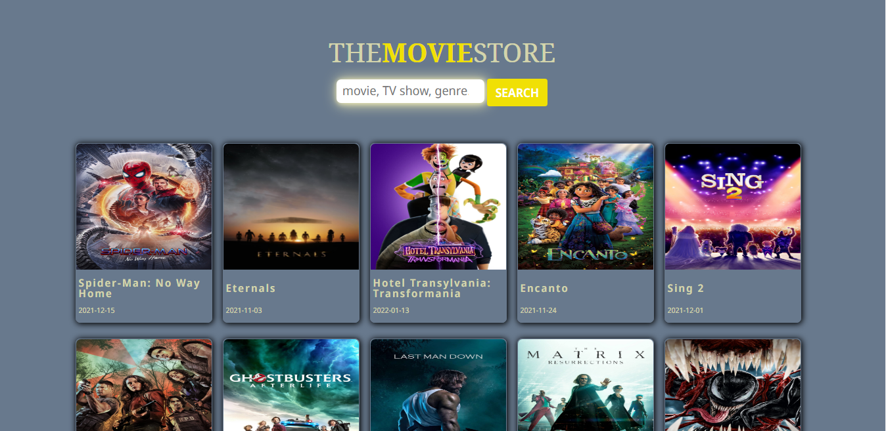
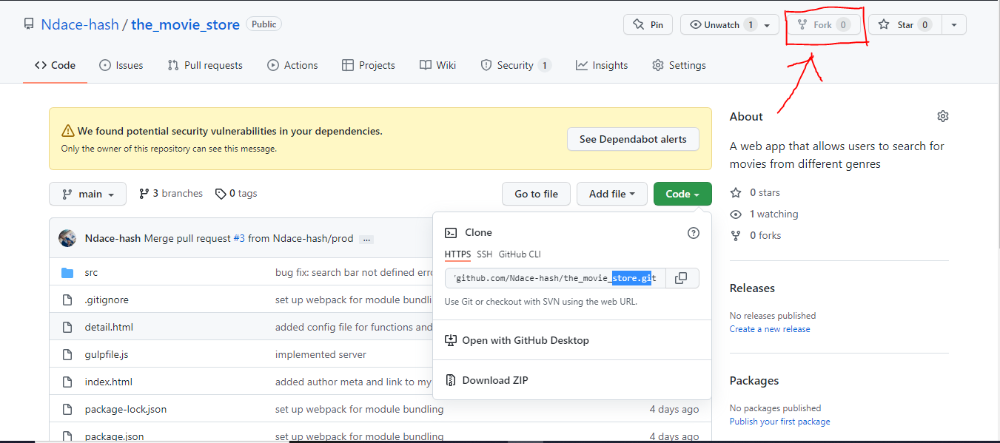
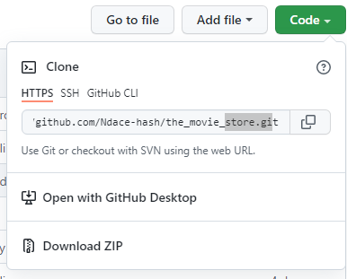
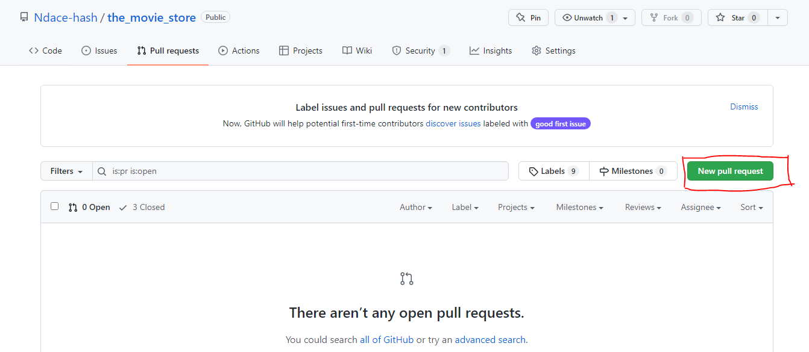

# The Movie Store

The Movie Store is a website that uses [The Movies Database API](https://www.themoviedb.org) to display recent popular movies and TV shows.



## How to use The Movie Store

The movie store can be accessed through [http://themoviestore.netlify.app](http://themoviestore.netlify.app).
There are no complex features on the website, you can just search for a movie or tv show and the website will display movies and tv shows relevant to your searched keyword.

## Contributing to this project

This section gives the step by step process for people who want to contribute to this project.
To contribute to this project, you will need to have nodeJS installed so you have access to npm(Node Package Manager) and also you need git version control.

Feel free to create an issue if you fine any problems in the code.

1. **Fork this repository**<br />
   If you look in the top right corner of your screen, you will find a button labelled fork.

   

   Click on it and GitHub will automatically create a version of this project for you.

1. **Clone your version of the project**<br/>
   Open your version of the project from your Github profile.
   Then can clone the repository with the following command:

   ```git
   git clone https://github.com/<your username>/the_movie_store.git
   ```

   

   After running the command above, you should have a version of the respository locally on your computer.

1. **Install the project dependencies**<br/>
   This Project has a few dependencies. To install the dependencies your have to go into your local version of the project with

   ```git
   cd the_movie_store
   ```

   Then run the command:

   ```node
   npm install
   ```

   and npm will go to the `package.json` and install all the necessary dependencies for the project.
   After this you are almost ready to start contributing.

1. **Create a new branch**<br/>
   When you have done the first three steps, you can create an new branch where you can make you changes and add new features by running this command:

   ```git
   git checkout -b your-branch-name
   ```

   Now you are all set to start adding new features and making changes to the project.

   When commiting changes, make sure to use descriptive commit messages.

1. **Push your code to Github**<br/>
   When you are done contributing, you push your new code to Github with

   ```git
   git push
   ```

   Now just one step left

1. **Create a pull request**<br/>
   Go to your Github fork and switch to the recently pushed branch from the last step.
   
   Create a pull request with a proper description, and wait for your changes to be reviewed.

<!-- Contributors can check the [contributors.md](./docs/contributors.md) for more understanding of the project structure, the how and why for certain decisions in the workflow. -->
